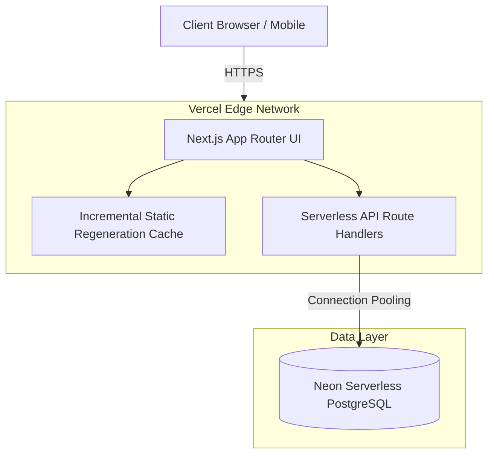

# CARER Platform

**Nasir Uddin Centre for Applied Research & Educational Resources**

A modern, full-stack consultancy website built with Next.js 16, React 19, TypeScript, and Neon serverless Postgres. Features a beautiful dark/light theme system, dynamic content management, and a modular architecture designed for easy backend switching.

## 🚀 Features

- ✅ **Modern Stack**: Next.js 16 (Turbopack), React 19, TypeScript, Tailwind CSS 4
- ✅ **Theme System**: Seamless light/dark mode with `next-themes`
- ✅ **Database**: Neon serverless Postgres with abstracted data layer
- ✅ **Type Safety**: Centralized TypeScript interfaces
- ✅ **Responsive**: Mobile-first design with glassmorphism effects
- ✅ **SEO Optimized**: Comprehensive metadata and social tags
- ✅ **ISR**: Incremental Static Regeneration (1-hour revalidation)
- ✅ **Modular Architecture**: Easy to switch backends (Neon → Firebase/Prisma/Supabase)

## 📁 Project Structure

```
carer-platform/
├── src/
│   ├── app/                  # Next.js App Router pages
│   │   ├── about/           # About page
│   │   ├── contact/         # Contact page + form actions
│   │   ├── research/        # Research areas
│   │   └── resources/       # Resources & certifications
│   ├── components/
│   │   ├── home/            # Homepage components
│   │   ├── shared/          # Reusable components (Navbar, Footer)
│   │   └── ui/              # UI primitives (shadcn/ui)
│   ├── lib/
│   │   ├── data/            # Abstract data client layer
│   │   └── db-utils.ts      # Database utility functions
│   └── types/               # Centralized TypeScript types
├── public/assets/           # Static assets
├── docs/                    # Project documentation
└── .env.example             # Environment variables template
```

## 🏗️ System Architecture



## 🛠️ Local Development

### Prerequisites

- Node.js 20+
- pnpm (package manager)
- Neon account (free tier available)

### Setup

1. **Clone the repository**
   ```bash
   git clone https://github.com/yourusername/carer-platform.git
   cd carer-platform
   ```

2. **Install dependencies**
   ```bash
   pnpm install
   ```

3. **Configure environment variables**
   ```bash
   cp .env.example .env.local
   ```
   
   Edit `.env.local` and add your Neon database URL:
   ```env
   DATABASE_URL=your_neon_database_connection_string
   ```

4. **Run development server**
   ```bash
   pnpm dev
   ```
   
   Open [http://localhost:3000](http://localhost:3000)

5. **Build for production**
   ```bash
   pnpm build
   pnpm start
   ```

## 🎨 Theme System

The platform supports both light and dark modes with a custom theme toggle. Theme preferences are persisted across sessions.

- **Default**: System preference
- **Toggle**: Available in navbar (desktop & mobile)
- **Customization**: Edit `src/app/globals.css` for theme colors

## 🔧 Backend Switching

The data layer is abstracted for easy backend changes:

1. **Current**: Neon serverless Postgres in `src/lib/data/client.ts`
2. **To Switch**: Implement the `DataClient` interface with your preferred backend
3. **Example**: Firebase, Prisma, REST API, GraphQL

```typescript
// src/lib/data/client.ts
export interface DataClient {
  fetchSettings(key: string): Promise<any>;
  fetchResearchAreas(): Promise<ResearchArea[]>;
  fetchCertifications(): Promise<Certification[]>;
}
```

## 📦 Key Dependencies

| Package | Purpose |
|---------|---------|
| `next@16.1.0` | React framework with App Router |
| `react@19` | UI library |
| `@neondatabase/serverless` | Serverless Postgres client |
| `next-themes` | Theme management |
| `tailwindcss@4` | Utility-first CSS |
| `lucide-react` | Icon library |
| `@radix-ui/*` | Accessible UI primitives |

## 🏗️ Database Schema

### Database Tables (Neon/PostgreSQL)

1. **site_settings**
   - `id` (uuid, primary key)
   - `key` (text, unique)
   - `value` (jsonb)

2. **research_areas**
   - `id` (uuid, primary key)
   - `title` (text)
   - `description` (text)
   - `icon` (text)
   - `created_at` (timestamp)

3. **certifications**
   - `id` (uuid, primary key)
   - `title` (text)
   - `description` (text)
   - `duration` (text)
   - `created_at` (timestamp)

## 📝 Scripts

```bash
pnpm dev          # Start development server
pnpm build        # Build for production
pnpm start        # Start production server
pnpm lint         # Run ESLint
pnpm lint:fix     # Fix ESLint issues
pnpm format       # Format code with Prettier
```

## 🚀 Deployment

### Vercel (Recommended)

1. Push to GitHub
2. Import project in Vercel
3. Add environment variables
4. Deploy!

### Other Platforms

The platform is compatible with any Node.js hosting provider that supports Next.js:
- Netlify
- AWS Amplify
- DigitalOcean App Platform
- Railway

## 🤝 Contributing

Contributions are welcome! Please follow these guidelines:

1. Fork the repository
2. Create a feature branch (`git checkout -b feature/amazing-feature`)
3. Commit your changes (`git commit -m 'feat: add amazing feature'`)
4. Push to the branch (`git push origin feature/amazing-feature`)
5. Open a Pull Request

### Commit Convention

We follow [Conventional Commits](https://www.conventionalcommits.org/):
- `feat:` New feature
- `fix:` Bug fix
- `docs:` Documentation changes
- `style:` Code style changes (formatting)
- `refactor:` Code refactoring
- `perf:` Performance improvements
- `test:` Test updates
- `chore:` Build process or auxiliary tool changes

## 📄 License

This project is proprietary and confidential.

## 🙏 Acknowledgments

- Built with [Next.js](https://nextjs.org/)
- UI components from [shadcn/ui](https://ui.shadcn.com/)
- Icons from [Lucide](https://lucide.dev/)
- Powered by [Neon](https://neon.tech/)

---

**Made with ❤️ by the CARER Development Team**
